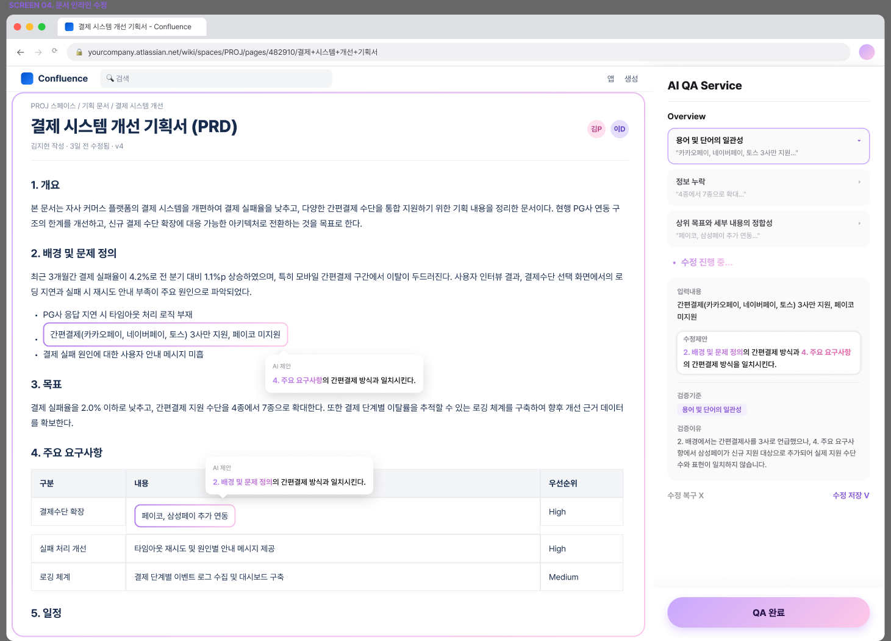

<div align="center">

# 🐾 똑독

### 서비스 기획서 품질 검증 도우미

**문서 검토의 기준과 결과에 일관성과 통일성을 더하다**

[](backend/pyproject.toml)
[](backend)
[](extension)
[](backend)
[](backend)

10팀 물개와 써니들 · SK SunniC (Cohort 5)
강유진 · 강혜서 · 송보미 · 송승현 · 송은성 · 임가영

[▶ 시연 영상](https://www.youtube.com/watch?v=VGgTPsqxMBQ)

</div>

---

## 왜 만들었나

기획서를 검토할 때 흔히 겪는 일이다.

- 같은 사람이 같은 문서를 봐도, 컨디션과 시간에 따라 놓치는 오류가 달라진다.
- 작성자 본인은 이미 전체 맥락을 알고 있어서, 정보 누락이나 모호한 표현을 스스로 발견하기 어렵다.
- AI에게 검토를 맡겨도 같은 문서·같은 프롬프트로 두 번 돌리면 지적 건수가 절반으로 줄거나 없던 항목이 새로 나타난다 — **AI 검토 역시 기준이 없으면 사람만큼 흔들린다.**

**똑독**은 AI가 기획서 내용을 대신 판단하고 고쳐주는 도구가 아니다. **무엇을 오류로 볼지에 대한 하나의 명확한 기준(룰북)을 세우고, 언제 누가 검토하더라도 그 기준을 똑같이 적용**하는 데 집중한다.

## 무엇을 하는가

Confluence 페이지를 열면 사이드 패널로 뜨는 크롬 익스텐션(`extension/`)과, QA 검증을 실제로 수행하는 FastAPI 백엔드(`backend/`)로 구성된 모노레포다.

1. Confluence 페이지를 열면 익스텐션이 본문을 자동으로 읽어와 마크다운 구조로 파싱한다.
2. 저비용 모델(Gemini)로 전체를 1차 스크리닝하고, 플래그된 구간만 정밀 모델(Sonnet)로 재검증하는 2단계 QA를 돌린다.
3. 발견된 이슈는 문서 위에 바로 하이라이트된다. 하이라이트를 클릭하면 위치·기준·이유·대치 제안이 담긴 말풍선이 뜨고, 실제 수정은 오른쪽 사이드 패널에서 한다.
4. **원본 페이지는 절대 건드리지 않는다.** 첫 수정을 저장하는 순간 원본의 자식 페이지로 복제본이 하나 생기고, 이후 수정은 전부 그 복제본에 누적된다.
5. 마지막 화면에서 원본/수정본을 토글하며 비교하고, 검토 내역을 클릭하면 해당 위치로 바로 이동해 확인할 수 있다.

> AI는 기획서를 임의로 수정하지 않는다. 문제 위치·이유·근거·제안까지만 하고, 반영 여부와 저장 시점은 항상 사용자가 결정한다.

<div align="center">

### 문서 인라인 수정

문서 위 하이라이트를 클릭해 AI 제안을 확인하고, 오른쪽 패널에서 수정 내용을 다듬어 저장하는 화면. 저장은 복제본에만 반영된다.



</div>

## 검토 기준 — 룰북

SK 실무 기획서 검토 패턴과 멘토 인터뷰를 바탕으로, AI가 판단하기 어려운 "주관적 좋고 나쁨"이 아니라 **객관적으로 검증 가능한 것만** 룰로 만들었다.

| 카테고리 | 방지하는 것 |
|---|---|
| `LG` 논리 비약 | 근거와 결론, 원인과 결과 사이의 연결이 충분하지 않은 서술 |
| `LF` 논리 흐름 | 전개 순서·연결성이 자연스럽지 않아 이해가 어려운 경우 |
| `TC` 용어 일관성 | 동일한 개념을 서로 다른 용어·표기로 사용하는 경우 |
| `TM` 용어 오용 | 용어를 정의된 의미와 다르게 쓰는 경우 |
| `AE` 모호한 표현 | 의미가 불명확하거나 여러 해석이 가능한 표현 |
| `MI` 정보 누락 | 문서 목적 달성에 필요한 정보가 없는 경우 |
| `RD` 불필요한 중복 | 동일하거나 유사한 내용을 반복 전달하는 경우 |
| `GA` 목표 정합성 | 상위 목표와 하위 내용이 일관되게 연결되지 않는 경우 |

**8개 카테고리 · 41개 세부 Rule**, 각 룰마다 "억지 지적"을 막는 예외 조건이 함께 정의돼 있다. 실제 검증에는 SK 실무 기획서 20건 + 오류를 주입한 더미 문서로 구성한 **196건 골든 데이터셋**과 **59건의 오탐 방지용 예외 데이터**를 썼다 — 골든셋 투입 결과 오류 18건 중 15건 감지, 예외조건 59건 중 56건을 정확히 방어했다.

룰북/데이터셋/검토 에이전트/평가 에이전트를 만드는 별도 파이프라인은 [`planqa-agent`](https://github.com/sunic5-planqa/planqa-agent) 레포에 있다 — 이 레포의 `backend/`는 그 검토 에이전트의 실서비스용 벤더링 사본을 호출한다.

## 셋업

### 백엔드 (`backend/`)

```bash
cd backend
uv sync
cp .env.example .env   # ANTHROPIC_API_KEY, GEMINI_API_KEYS 채우기
uv run uvicorn sunnic_backend.main:app --reload
```

`GET /healthz` 로 기동 확인, `GET /docs` 에서 API 스펙 확인.

### 크롬 익스텐션 (`extension/`)

```bash
cd extension
npm install
npm run build
```

`chrome://extensions`에서 "압축해제된 확장 프로그램 로드"로 `extension/dist`를 불러오면 된다. 개발 중엔 `npm run dev`(HMR)도 가능.

익스텐션 아이콘을 누르면 사이드 패널이 열린다. 지금 보고 있는 탭이 Confluence 페이지면 그 페이지를 대상으로 QA를 시작할 수 있다.

처음 기여하는 팀원은 [`CONTRIBUTING.md`](CONTRIBUTING.md)와 [`docs/onboarding/`](docs/onboarding)를 먼저 확인할 것.

## API

| # | 엔드포인트 | 기능 |
|---|---|---|
| 1 | `POST /documents` | 마크다운 텍스트 접수 + 구조 파싱 |
| 2 | `GET /documents/count` | 지금까지 검토한 문서 수 조회 |
| 3 | `POST /documents/{id}/qa-jobs` | QA 검증 시작 (비동기) |
| 4 | `GET /qa-jobs/{job_id}/status` | 진행 상태 조회 (폴링) |
| 5 | `GET /qa-jobs/{job_id}/issues` | 이슈 리스트 조회 |
| 6 | `PATCH /issues/{issue_id}` | 적용/스킵/직접수정 반영 |
| 7 | `GET /documents/{id}/export` | 최종 결과 텍스트 생성 |

QA 라우팅(어느 이슈를 정밀 모델까지 보낼지)은 전부 백엔드 코드가 결정하며, LLM이 스스로 다른 모델을 호출하지 않는다.

## v1 스코프

**포함**: 마크다운(`#`/`##`) 기반 구조 파싱, 계층별(문서/챕터/문단/문장) QA 검증(단어 레벨 제외), 이슈별 위치/기준/이유/대치제안, apply/skip/edit, 원본 보존 + 복제본 저장.

**제외**: 영구 저장(DB), QA Level 강도 슬라이더, 문서 간 비교.

---

<div align="center">

기획서를 대신 쓰지 않습니다. 같은 기준으로 읽고, 같은 근거로 지적합니다.

</div>
